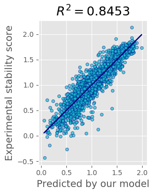
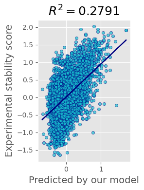

# House of Mutants GitHub
This is the GitHub repository for the Copenhagen BioHackathon 2021

## Team Members
Tanya (GitHub: [latticetower](https://github.com/latticetower))

Sven (GitHub: [sklumpe](https://github.com/sklumpe))

Thomas (GitHub: [ngthomas](https://github.com/ngthomas))

Michael (GitHub: [MSBradshaw](https://github.com/MSBradshaw))

Here, we look at two data sets of single of multi mutant sequences,
their wildtype secondary structure and biophysical descriptors to
predict stability scores of both single and multiple mutations within
the protein sequence.

## Model
We've decided that we want to focus on features and want to start with a strong baseline. We've chosen [catboost](https://catboost.ai). It gives good results out of the box, it is interpretable, feature scaling doesn't affect its performance - all because it uses gradient boosting on decision trees. It also works ok with categorical features. After that we were trying to deal with the data :slightly_smiling_face: and improve our models.

Our baseline solution uses N-fold cross-validation, for each fold we train the model and use the trained models as an ensemble. We average their predictions to get the final prediction.

### Single mutants
The performance of our current best solution for single mutants test file is shown on the plot:

Reproducible code can be found at [ipynb notebook](notebooks/catboost-cross-val-models-multiple-mutants-with-features.ipynb).

### Multiple mutants
The performance of our current best solution for multiple mutants test file is shown on the plot:

Reproducible code can be found at [ipynb notebook](notebooks/catboost_cv_sing_mut_slim.ipynb).

### Things we wanted to do to run the world, but didn't finish

At the hackathon we've managed to dig into original paper's supplementary and found pdb structures for all non-mutated proteins. Many of them appear to have 0-3 aminoacids from N-terminus missing there. We've computed contact maps and designed baseline with it, however didn't completely finished the code and didn't run it.

Unfinished code can be found at [ipynb notebook](notebooks/catboost-cross-val-models-multiple-mutants-cmaps.ipynb); the ugly process of data checking and contact maps extraction can be found at [another notebook](notebooks/EDA-pdb.ipynb) - this one run on your own risk.

## Misc
Please also see the our team's [BioLib page](https://biolib.com/house-of-mutants-mt24/house-of-mutants/) for further information

# License

The code belongs to us, the data belongs to Baker lab and their collaborators (currently I'm not sure about its licensing).
